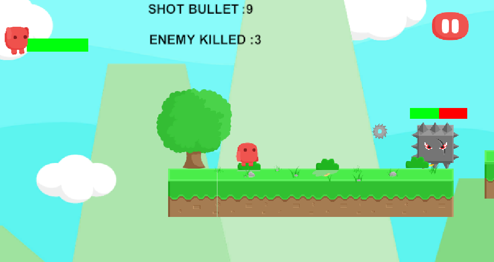

# 🎮 2D Aksiyon Oyunu (Unity)

Bu proje, Unity kullanılarak geliştirilmiş basit bir 2D aksiyon oyunudur. Amaç, düşmanlardan kaçarken onları vurmak ve hayatta kalmaktır.

---

## 🧠 Oyun Mekanikleri

- 🎯 **Karakter hareketi**  
  - Sağa gitme: `D` tuşu veya Sağ yön tuşu  
  - Sola gitme: `A` tuşu veya Sol yön tuşu  
  - Zıplama: `W` tuşu veya Yukarı yön tuşu

- 🔫 **Saldırı**  
  - Sol mouse tıklaması ile kurşun fırlatılır  
  - Düşmanla çarpışıldığında oyuncu hasar alır

- 💥 **Düşman Mekaniği**  
  - Düşman karakter, oyuncuyu takip eder ve çarpıştığında zarar verir  
  - Oyuncunun attığı kurşun düşmana çarparsa düşman ölür

---

## 🛠️ Kullanılan Özellikler

- Unity 2D Fizik sistemi (`Rigidbody2D`, `Collider2D`)
- UI öğeleri: `Slider` ile sağlık barı, `TextMesh` ile hasar gösterimi
- Basit `Animator` ile animasyon kontrolü
- Sahne geçişleri, butonla kontrol
- `DataManager` ile veri takibi (kaç mermi atıldı, kaç düşman öldü)

---

## 🧩 Kontroller

| Eylem              | Tuşlar                   |
|--------------------|--------------------------|
| Sağa hareket       | `D` veya Sağ yön         |
| Sola hareket       | `A` veya Sol yön         |
| Zıplama            | `W` veya Yukarı yön      |
| Kurşun fırlatma    | Sol Mouse Tıklaması      |

---

## 📦 Build

Unity 2022.3 LTS sürümünde geliştirilmiştir.  
Projeyi `Assets/Scenes/MenuScene` sahnesiyle başlatabilirsiniz.

## 📸 Oyundan Kesitler 

## ✍️ Not

> Bu proje, oyun geliştirme sürecimi göstermek ve işe başvuru portfolyomu oluşturmak amacıyla geliştirilmiştir.
